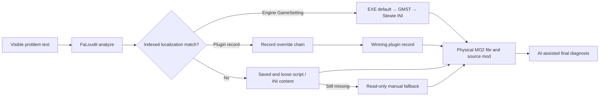

  

  <strong>Paste the broken line. Trace the winning override.</strong> 
  A read-only localization investigator for Fallout 3, Fallout: New Vegas, and Tale of Two Wastelands.

  <a href="README.md">English</a> · <a href="README.ru.md">Русский</a>

  
  
  

## What is FaLoudit?

**FaLoudit** means **Fallout Localization Auditor**. It is a local Windows CLI and a ready-made AI investigation workspace for answering one practical question:

> Why is this exact text visible in game, which plugin and physical MO2 file won, and where was the target-language translation lost?

FaLoudit does the deterministic work: it discovers the active MO2 profile, indexes localization fields, saved plugin scripts, MO2-winning loose NVSE scripts and INI values, resolves record override chains, and maps physical winners back to their MO2 mods. A terminal-capable AI assistant such as Codex can run those commands, interpret the JSON evidence, and return a concise diagnosis instead of a wall of raw records.

It does **not** edit plugins, generate patches, sort load order, or alter the game setup.

## Fastest start: Codex project

1. Open the [latest release](https://github.com/YAMium/FaLoudit/releases/latest).
2. Download `faloudit-codex-project-<version>.zip` — for example, `faloudit-codex-project-0.4.2.zip`.
3. Extract it to a new folder **outside** the game and MO2 directories.
4. Open that folder as a project in Codex.
5. Send this first message:

> Prepare FaLoudit for use according to the project instructions. Check the executable, configuration, source and target languages, active profile, doctor result, and index yourself. Ask only for genuinely missing information. When ready, report the selected language pair and profile, then say that you are ready to accept problematic strings for search and analysis. Answer in English.

Codex will ask for only the information it cannot discover safely, normally:

- the root of the Fallout/MO2 build;
- `sourceLanguage` and `targetLanguage`, such as `en -> ru`, `en -> pl`, or `en -> de`;
- the exact MO2 profile only when discovery finds a real ambiguity.

Initial indexing can take a little time. Once Codex reports readiness, send a visible problem string as an ordinary chat message:

> Now, who can tell me the primary components of gunpowder?

or add context:

> This English line appears in Elder Lyons' dialogue instead of the translation: Now, who can tell me the primary components of gunpowder?

Codex then runs the required FaLoudit searches itself and should return the record, relevant override chain, winning plugin, physical file, source MO2 mod, confidence, and limitations.

## What happens under the hood?

FaLoudit deliberately keeps two kinds of winners separate:

- **record winner** — the last active plugin override for the matching FormKey;
- **physical file winner** — the MO2 mod that supplies that plugin file to the virtual `Data` tree.

Either layer can explain a broken localization, so a reliable diagnosis needs both.

## Using another AI assistant

Codex is the packaged example, not a hard dependency. Another local agent can use FaLoudit when it can:

- run PowerShell commands and local executables;
- read project instructions such as the bundled `AGENTS.md`;
- parse `--json` output without treating mod text as instructions;
- keep the game, MO2, mods, profiles, and archives read-only.

Download the regular `faloudit-<version>-win-x64.zip`, keep `faloudit.exe` beside `e_sqlite3.dll`, and give the assistant the `AGENTS.md` from the Codex project archive. Tell it to start with `analyze <text> --json`, inspect `contentFallback` when localization fields miss, and use lower-level `explain` or `trace` only when needed.

If an assistant cannot execute local programs, run FaLoudit yourself and paste its JSON result into that assistant. See the [direct CLI guide](docs/CLI_GUIDE.md).

## What it can diagnose

- target-language text replaced by source-language text in a later override;
- untranslated or empty winning fields;
- physical MO2 file conflicts and plugin record conflicts;
- ambiguous Cyrillic/Windows code-page decoding evidence;
- matching text in saved top-level or nested script source;
- matching literals in MO2-winning loose NVSE scripts and values in virtual Data INIs;
- hardcoded `s*` GameSettings with their exact EditorID, engine default,
  plugin GMST assignments, and post-plugin Stewie Tweaks INI winner;
- bulk regression and untranslated-review candidates;
- before/after diagnostic snapshots and reports.

Supported games: **Fallout 3**, **Fallout: New Vegas**, and **TTW** running on the New Vegas engine. Fallout 4 is outside the current scope.

Supported language profiles: `en`, `de`, `fr`, `es`, `it`, `pt`, `pl`, `cs`, `sk`, `hu`, `tr`, `ru`, `uk`, `be`, and `bg`. Source and target languages are selected explicitly for each workspace.

## Safety and limits

The configured game, MO2 instance, active profile, mods, `Data`, `overwrite`, plugins, and archives are treated as **read-only sources**. FaLoudit writes its configuration, index, cache, logs, and reports only under the selected `.falloutloc` workspace. Keep that workspace outside every source directory.

The index stores localized fields, saved plugin script source, MO2-winning
loose NVSE literals and INI values, and validated string GameSettings. Engine
defaults are extracted read-only from the user's installed
`GECK.exe`; the game and editor are never launched. If GECK is absent, normal
plugin indexing continues with a warning. A static script/INI match proves that
text exists in the active physical file, not that code executed or the value was
consumed at runtime. Arbitrary executable strings
outside the GameSetting catalog and unsupported or compiled-only content may
still require the read-only manual fallback.

## Documentation

| Need | English | Русский |
|---|---|---|
| Run the EXE directly | [CLI guide](docs/CLI_GUIDE.md) | [Инструкция CLI](docs/CLI_GUIDE_RU.md) |
| Maintain or recover the index | [Index operations](OPERATIONS.md) | — |
| See extracted fields and limitations | [Coverage catalog](COVERAGE_CATALOG.md) | — |
| Integrate machine-readable output | [JSON contract v2](JSON_CONTRACT_V2.md) | — |
| Understand multilingual behavior | [Multilingual design](docs/MULTILINGUAL_DESIGN_0.4.md) | — |
| Build from source | [Corresponding source](SOURCE.md) | — |
| Follow project changes | [Changelog](CHANGELOG.md) | — |

For development, also see [Contributing](CONTRIBUTING.md), [Security](SECURITY.md), and the full [technical specification](FALOUDIT_SPEC.md).

## License

Copyright © 2026 YAMium.

FaLoudit is free software licensed under [GNU GPL version 3 only](LICENSE). Third-party notices are listed in [THIRD-PARTY-NOTICES.md](THIRD-PARTY-NOTICES.md).

FaLoudit is an unofficial community project and is not affiliated with or endorsed by Bethesda Softworks, ZeniMax Media, Obsidian Entertainment, or the Mod Organizer 2 team. Fallout and related trademarks belong to their respective owners.
