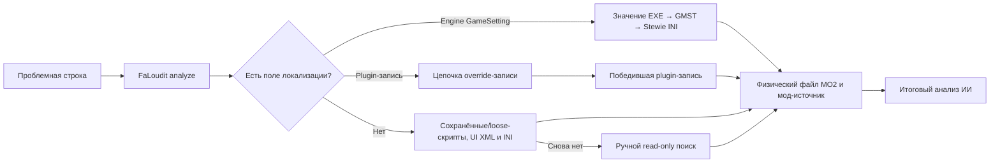

  

  <strong>Пришлите проблемную строку. FaLoudit проследит, какой override победил.</strong> 
  Диагностика локализаций Fallout 3, Fallout: New Vegas и Tale of Two Wastelands без изменения сборки.

  <a href="README.md">English</a> · <a href="README.ru.md">Русский</a>

  
  
  

## Что такое FaLoudit?

**FaLoudit** — сокращение от **Fallout Localization Auditor**. Это локальная Windows-утилита и готовое окружение для исследования переводов с помощью ИИ. Она отвечает на практический вопрос:

> Почему в игре видна именно эта строка, какой plugin и физический файл MO2 победили и где потерялся перевод на выбранный язык?

FaLoudit выполняет проверяемую техническую часть: определяет активный профиль MO2, индексирует поля локализации, сохранённые plugin-скрипты, победившие loose NVSE-скрипты, текст UI XML и значения INI, строит цепочку override-записей и связывает физические файлы с модами MO2. Codex или другой ИИ-инструмент с доступом к терминалу запускает команды, разбирает JSON-доказательства и возвращает понятный итог вместо массива сырых записей.

FaLoudit **не** редактирует плагины, не создаёт патчи, не сортирует загрузку и не меняет сборку.

## Самый простой запуск через Codex

1. Откройте страницу [последнего релиза](https://github.com/YAMium/FaLoudit/releases/latest).
2. Скачайте `faloudit-codex-project-<версия>.zip`, например `faloudit-codex-project-0.4.3.zip`.
3. Распакуйте архив в новую папку **за пределами** игры и каталогов MO2.
4. Откройте эту папку как проект в Codex.
5. Отправьте первый промт:

> Подготовь FaLoudit к работе по инструкции проекта. Сам проверь наличие утилиты, конфигурацию, языки исходника и перевода, активный профиль, doctor и индекс. Если нужных данных действительно не хватает — спроси только их. Когда всё будет готово, сообщи выбранную языковую пару и профиль, затем напиши, что готов принимать проблемные строки для поиска и анализа.

Codex запросит только то, что невозможно безопасно определить самостоятельно. Обычно это:

- корневая папка сборки Fallout/MO2;
- `sourceLanguage` и `targetLanguage`, например `en -> ru`, `en -> pl` или `en -> de`;
- точное имя профиля MO2, только если обнаружено несколько реальных вариантов.

Первичная индексация может занять некоторое время. После сообщения о готовности отправляйте проблемную строку обычным сообщением:

> Advanced Targeting Sensor

или сразу добавьте контекст:

> В диалоге старейшины вместо перевода показывается: Now, who can tell me the primary components of gunpowder?

Codex самостоятельно выполнит поиск и вернёт запись, важную часть цепочки override, победивший plugin, физический файл, исходный MO2-мод, уверенность вывода и ограничения.

## Как это работает?

FaLoudit специально разделяет двух победителей:

- **победитель записи** — последний активный plugin override для найденного FormKey;
- **победитель физического файла** — мод MO2, который предоставляет этот plugin в виртуальный `Data`.

Проблема локализации может возникнуть на любом из этих уровней, поэтому для надёжного диагноза нужны оба.

## Другие ИИ-инструменты

Codex — готовый пример использования, но не обязательная зависимость. Другой локальный агент тоже сможет работать с FaLoudit, если он умеет:

- запускать PowerShell и локальные EXE-файлы;
- читать инструкции проекта, например комплектный `AGENTS.md`;
- разбирать результат `--json`, не принимая текст из модов за инструкции;
- сохранять игру, MO2, моды, профили и архивы строго read-only.

Скачайте обычный архив `faloudit-<версия>-win-x64.zip`, оставьте `faloudit.exe` рядом с `e_sqlite3.dll` и передайте агенту `AGENTS.md` из Codex-архива. Попросите начинать с `analyze <строка> --json`, проверять `contentFallback`, если совпадений в полях локализации нет, и обращаться к `explain` или `trace` только при необходимости.

Если ИИ не умеет запускать локальные программы, запустите FaLoudit вручную и передайте ему полученный JSON. Подробности находятся в [инструкции прямого запуска](docs/CLI_GUIDE_RU.md).

## Что умеет находить FaLoudit

- перевод, заменённый исходным текстом в более позднем override;
- непереведённые или пустые поля победившей записи;
- конфликты физических файлов MO2 и конфликты plugin-записей;
- неоднозначности декодирования кириллицы и Windows code page;
- текст в сохранённых верхнеуровневых и вложенных исходниках скриптов;
- литералы в победивших loose NVSE-скриптах `.txt` и текстовых GECK-исходниках
  `.gek`, а также значения виртуальных Data INI;
- экранный текст в победивших `Menus/**/*.xml` с полной цепочкой физических
  провайдеров MO2 для UI-конфликтов;
- встроенные `s*` GameSettings с точным EditorID, исходным значением движка,
  GMST из плагинов и победившим послеплагинным INI Stewie’s Tweaks;
- массовые кандидаты на регрессии и непереведённые строки;
- различия между диагностическими снимками «до» и «после».

Поддерживаются **Fallout 3**, **Fallout: New Vegas** и **TTW** на движке New Vegas. Fallout 4 пока не входит в scope проекта.

Доступные языковые профили: `en`, `de`, `fr`, `es`, `it`, `pt`, `pl`, `cs`, `sk`, `hu`, `tr`, `ru`, `uk`, `be` и `bg`. Языки исходника и перевода задаются явно для каждого workspace.

## Безопасность и ограничения

Игра, экземпляр MO2, активный профиль, моды, `Data`, `overwrite`, плагины и архивы считаются строго **read-only источниками**. FaLoudit записывает конфигурацию, индекс, кэш, логи и отчёты только в выбранный workspace `.falloutloc`. Он должен находиться за пределами всех исходных каталогов.

Индекс хранит поля локализации, сохранённый исходник plugin-скриптов, литералы
победивших loose NVSE-скриптов `.txt`/`.gek`, текст UI XML, значения INI и проверенные строковые
GameSettings. Исходные значения движка извлекаются чтением из
установленного у пользователя `GECK.exe`; игра и редактор не запускаются. Если
GECK отсутствует, обычная индексация плагинов продолжается с предупреждением.
Статическое совпадение в скрипте, INI или XML доказывает наличие текста в активном
физическом файле, но не выполнение кода или использование значения во время
игры. Произвольные строки EXE вне каталога GameSettings,
неподдерживаемый контент и скрипты без исходника всё ещё могут потребовать
ручного read-only поиска.

## Документация

| Задача | Русский | English |
|---|---|---|
| Запустить EXE напрямую | [Инструкция CLI](docs/CLI_GUIDE_RU.md) | [CLI guide](docs/CLI_GUIDE.md) |
| Обслужить или восстановить индекс | [Index operations](OPERATIONS.md) | [Index operations](OPERATIONS.md) |
| Посмотреть поддержанные поля и ограничения | [Coverage catalog](COVERAGE_CATALOG.md) | [Coverage catalog](COVERAGE_CATALOG.md) |
| Интегрировать машинный JSON | [JSON contract v2](JSON_CONTRACT_V2.md) | [JSON contract v2](JSON_CONTRACT_V2.md) |
| Разобраться в многоязычной логике | [Multilingual design](docs/MULTILINGUAL_DESIGN_0.4.md) | [Multilingual design](docs/MULTILINGUAL_DESIGN_0.4.md) |
| Собрать из исходников | [Corresponding source](SOURCE.md) | [Corresponding source](SOURCE.md) |
| Посмотреть историю изменений | [Changelog](CHANGELOG.md) | [Changelog](CHANGELOG.md) |

Разработчикам также пригодятся [Contributing](CONTRIBUTING.md), [Security](SECURITY.md) и полная [техническая спецификация](FALOUDIT_SPEC.md).

## Лицензия

Copyright © 2026 YAMium.

FaLoudit распространяется по лицензии [GNU GPL version 3 only](LICENSE). Уведомления о сторонних компонентах находятся в [THIRD-PARTY-NOTICES.md](THIRD-PARTY-NOTICES.md).

FaLoudit — неофициальный проект сообщества. Он не связан с Bethesda Softworks, ZeniMax Media, Obsidian Entertainment или командой Mod Organizer 2 и не одобрен ими. Fallout и связанные товарные знаки принадлежат их владельцам.
